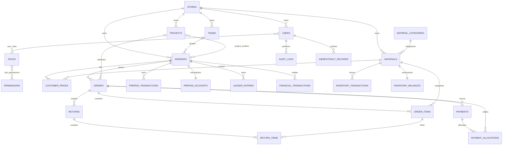

# 云记账 PostgreSQL 设计（Phase 0 草案）

> PostgreSQL 是生产数据源；Schema 仅由 golang-migrate 管理，不在服务启动时 AutoMigrate。

## 1. ER Diagram

## 2. 通用约定

- 主键：UUID，应用生成 UUIDv7（或 PostgreSQL 可用的等价有序 UUID）。
- 所有业务表包含 `store_id UUID NOT NULL`；Repository 查询必须同时限定 store_id。
- 时间：`TIMESTAMPTZ`，UTC 存储；业务日由 Store.timezone 解释。
- 金额：`NUMERIC(20,2)`；数量：`NUMERIC(20,3)`；禁止 PostgreSQL money 类型。
- 枚举采用 TEXT + CHECK，便于 migration 显式演进。
- 财务流水无 `deleted_at`；禁止 UPDATE/DELETE，权限和数据库角色共同限制。
- 外键默认 RESTRICT；历史业务不使用 CASCADE DELETE。

## 3. 身份与门店

### stores

`id UUID PK`; `name VARCHAR(100) NOT NULL`; `phone VARCHAR(30)`; `address VARCHAR(300)`; `timezone VARCHAR(64) NOT NULL DEFAULT 'Asia/Shanghai'`; `status TEXT NOT NULL CHECK IN ('ACTIVE','DISABLED')`; `created_at,updated_at TIMESTAMPTZ NOT NULL`。Index `(status)` 可选，V1 无需额外。

### users

`id UUID PK`; `store_id UUID FK stores RESTRICT`; `account VARCHAR(80)`; `password_hash TEXT`; `name VARCHAR(80)`; `phone VARCHAR(30)`; `status TEXT CHECK ACTIVE/DISABLED`; `auth_version BIGINT DEFAULT 1 CHECK >0`; timestamps。Unique `(store_id,account)`；index `(store_id,status)`。密码 hash 使用 Argon2id 或 bcrypt。

### roles / permissions / user_roles / role_permissions

- roles：`id UUID PK, store_id UUID NULL FK, code VARCHAR(80), name VARCHAR(100), created_at`；Unique `(store_id,code)`，系统模板角色可 store_id NULL。
- permissions：`id UUID PK, code VARCHAR(100) UNIQUE, description TEXT`。
- user_roles：`user_id FK, role_id FK, PRIMARY KEY(user_id,role_id)`；应用验证同店。
- role_permissions：`role_id FK, permission_id FK, PRIMARY KEY(role_id,permission_id)`。

### refresh_sessions

`id UUID PK`; `store_id,user_id FK`; `token_hash BYTEA UNIQUE`; `expires_at,revoked_at,last_used_at,created_at`; `user_agent TEXT`; `ip INET`; `replaced_by_id UUID NULL FK self RESTRICT`。Index `(user_id,expires_at)`、`(expires_at) WHERE revoked_at IS NULL`。

## 4. 客户与基础资料

### teams

`id UUID PK`; `store_id FK`; `name VARCHAR(100)`; `leader_name VARCHAR(80)`; `phone VARCHAR(30)`; `status TEXT CHECK`; `remark VARCHAR(500)`; `version BIGINT CHECK >0`; timestamps。Unique 可选 `(store_id,name)`（需确认是否允许重名）；index `(store_id,status)`。

### workers

`id UUID PK`; `store_id FK`; `team_id UUID NULL FK teams RESTRICT`; `name VARCHAR(80)`; `phone VARCHAR(30)`; `wechat VARCHAR(100)`; `address VARCHAR(300)`; `credit_limit NUMERIC(20,2) NULL CHECK >=0`; `status TEXT CHECK`; `remark VARCHAR(500)`; `current_receivable NUMERIC(20,2) NOT NULL DEFAULT 0`; `prepaid_balance_cache NUMERIC(20,2) NOT NULL DEFAULT 0 CHECK >=0`; `version BIGINT CHECK >0`; `created_by UUID FK users`; timestamps。Indexes `(store_id,status)`, `(store_id,team_id)`, `(store_id,name)`, `(store_id,phone)`。

### projects / project_workers

- projects：`id UUID PK`; `store_id`; `team_id NULL`; `name VARCHAR(160)`; `address VARCHAR(300)`; `manager_name VARCHAR(80)`; `contact_phone VARCHAR(30) NULL`; `start_date,end_date DATE NULL`; `status TEXT CHECK IN (PLANNING,ACTIVE,COMPLETED,CANCELLED)`; `remark VARCHAR(500)`; `version BIGINT`; timestamps；CHECK `end_date IS NULL OR start_date IS NULL OR end_date>=start_date`。Indexes `(store_id,status)`, `(store_id,team_id)`。
- project_workers：`store_id`; `project_id FK`; `worker_id FK`; `created_at`; PK `(project_id,worker_id)`；index `(store_id,worker_id)`。应用/触发约束保证三者同店。

### material_categories / materials

- material_categories：`id UUID PK`; `store_id`; `name VARCHAR(80)`; `status TEXT`; timestamps；Unique `(store_id,name)`。
- materials：`id UUID PK`; `store_id`; `category_id UUID NULL FK`; `category_name VARCHAR(80)`（兼容当前字符串及快照）; `name VARCHAR(160)`; `brand VARCHAR(80)`; `specification VARCHAR(80)`; `unit VARCHAR(30)`; `default_sale_price NUMERIC(20,2) CHECK >=0`; `cost_price NUMERIC(20,2) CHECK >=0`; `status TEXT`; `version BIGINT`; timestamps。Indexes `(store_id,status)`, `(store_id,category_id)`, `(store_id,brand)`, `(store_id,name)`。

### customer_prices

`id UUID PK`; `store_id`; `worker_id FK`; `material_id FK`; `price NUMERIC(20,2) CHECK >=0`; `effective_from TIMESTAMPTZ`; `effective_to TIMESTAMPTZ NULL`; `status TEXT`; `version BIGINT`; timestamps。CHECK `effective_to IS NULL OR effective_to>effective_from`；index `(store_id,worker_id,material_id,effective_from DESC)`。必须用 exclusion constraint（`btree_gist`）或事务锁阻止同一 worker/material 的 ACTIVE 时间区间重叠。

## 5. 业务单据

### business_sequences

`store_id UUID`; `business_date DATE`; `business_type TEXT`; `last_value BIGINT CHECK >=0`; `updated_at`; PK `(store_id,business_date,business_type)`。通过 INSERT ... ON CONFLICT + 行锁原子递增，不使用 MAX+1。

### orders

`id UUID PK`; `store_id`; `order_no VARCHAR(40)`; `worker_id FK`; `worker_name_snapshot VARCHAR(80)`; `project_id UUID NULL FK`; `project_name_snapshot VARCHAR(160) NULL`; `status TEXT CHECK IN (DRAFT,CONFIRMED,PARTIALLY_PAID,PAID,REVERSED)`; `goods_amount,discount_amount,final_amount,payment_amount,prepaid_deduction_amount,added_receivable,returned_amount,settled_amount,outstanding_amount NUMERIC(20,2) NOT NULL CHECK >=0`; `payment_method TEXT NULL CHECK`; `remark VARCHAR(500)`; `occurred_at,confirmed_at,created_at,updated_at TIMESTAMPTZ`; `created_by UUID FK`; `reversed_at TIMESTAMPTZ NULL`; `reversed_by UUID NULL FK`。Unique `(store_id,order_no)`；CHECK `goods_amount-discount_amount=final_amount`; CHECK `final_amount=payment_amount+prepaid_deduction_amount+added_receivable`。Indexes `(store_id,worker_id,occurred_at DESC)`, `(store_id,status,occurred_at DESC)`, `(store_id,project_id)`。

### order_items

`id UUID PK`; `store_id`; `order_id FK RESTRICT`; `material_id FK RESTRICT`; name/brand/specification/unit snapshots；`unit_price NUMERIC(20,2) CHECK >=0`; `quantity NUMERIC(20,3) CHECK >0`; `gross_amount,discount_amount,subtotal NUMERIC(20,2) CHECK >=0`; `price_source TEXT CHECK IN (MANUAL,CUSTOMER,DEFAULT)`; `created_at`。CHECK `gross-discount=subtotal`；indexes `(order_id)`, `(store_id,material_id,created_at)`。

### payments / payment_allocations

- payments：`id UUID PK`; `store_id`; `payment_no`; `worker_id`; `order_id NULL`（兼容未来指定单）; `amount NUMERIC(20,2) CHECK >0`; `payment_method TEXT CHECK IN (WECHAT,ALIPAY,CASH,BANK_CARD,OTHER)`; `occurred_at`; `status TEXT CHECK IN (CONFIRMED,REVERSED)`; `remark`; `created_by`; `created_at`; reversal metadata。Unique `(store_id,payment_no)`；index `(store_id,worker_id,occurred_at DESC)`。
- payment_allocations：`id UUID PK`; `store_id`; `payment_id FK`; `order_id FK`; `amount NUMERIC(20,2) CHECK >0`; `created_at`; Unique `(payment_id,order_id)`；indexes `(order_id)`, `(store_id,payment_id)`。所有 allocation 总和必须等于 Payment.amount，由事务校验。

### returns / return_items

- returns：`id UUID PK`; `store_id`; `return_no`; `worker_id`; `original_order_id FK`; `project_id NULL`; `total_amount NUMERIC(20,2) CHECK >0`; `receivable_reduction NUMERIC(20,2) CHECK >=0 AND <=total_amount`; `settlement_type TEXT CHECK IN (CREDIT_RECEIVABLE,CASH_REFUND,PREPAID_REFUND)`；兼容阶段固定 CREDIT_RECEIVABLE；`status TEXT CHECK IN (PENDING,CONFIRMED,REVERSED)`; `reason/remark`; `occurred_at`; `created_by,confirmed_by`; timestamps/reversal metadata。Unique `(store_id,return_no)`；indexes `(store_id,worker_id,occurred_at)`, `(original_order_id,status)`。
- return_items：`id UUID PK`; `store_id`; `return_id FK`; `material_id FK`; `original_order_item_id FK`; snapshots；`quantity NUMERIC(20,3) CHECK >0`; `unit_price NUMERIC(20,2)`; `amount NUMERIC(20,2) CHECK >0`; `created_at`。Indexes `(original_order_item_id)`, `(return_id)`。

### adjustments

`id UUID PK`; `store_id`; `adjustment_no`; `worker_id`; `direction TEXT CHECK IN (INCREASE,DECREASE)`; `amount NUMERIC(20,2) CHECK >0`; `reason TEXT NOT NULL`; `status TEXT CHECK IN (CONFIRMED,REVERSED)`; `occurred_at`; `created_by`; timestamps/reversal metadata。Unique `(store_id,adjustment_no)`。

## 6. 三套账与库存

### ledger_entries

`id UUID PK`; `store_id`; `worker_id`; `project_id NULL`; `ledger_no`; `type TEXT CHECK IN (OPENING_BALANCE,ORDER_CHARGE,ORDER_PAYMENT,PREPAID_DEDUCTION,PAYMENT,RETURN_CREDIT,ADJUSTMENT,REVERSAL)`; `signed_amount NUMERIC(20,2) NOT NULL CHECK <>0`; `balance_after NUMERIC(20,2) NOT NULL`; `source_type TEXT`; `source_id UUID`; `source_no VARCHAR(40)`; `reversal_of_id UUID NULL FK self RESTRICT`; `remark`; `occurred_at`; `created_by`; `created_at`。Unique `(store_id,ledger_no)`；Unique partial `(reversal_of_id) WHERE reversal_of_id IS NOT NULL`；indexes `(store_id,worker_id,occurred_at,id)`, `(store_id,source_type,source_id)`。禁止更新/删除。

### prepaid_accounts / prepaid_transactions

- prepaid_accounts：`id UUID PK`; `store_id`; `worker_id`; `balance NUMERIC(20,2) CHECK >=0`; `version BIGINT CHECK >0`; timestamps；Unique `(store_id,worker_id)`。
- prepaid_transactions：`id UUID PK`; `store_id`; `worker_id`; `transaction_no`; `type TEXT CHECK IN (DEPOSIT,DEDUCTION,REFUND,ADJUSTMENT,REVERSAL)`; `signed_amount NUMERIC(20,2) CHECK <>0`; `balance_before,balance_after NUMERIC(20,2) CHECK >=0`; source columns；`reversal_of_id`; `remark`; `occurred_at`; `created_by`; `created_at`。Unique business no；partial unique reversal；index `(store_id,worker_id,occurred_at,id)`。禁止更新/删除。

### financial_transactions

`id UUID PK`; `store_id`; `transaction_no`; `type TEXT CHECK IN (ORDER_PAYMENT,PAYMENT,PREPAID_DEPOSIT,PREPAID_REFUND,RETURN_REFUND,REVERSAL)`; `direction TEXT CHECK IN (INCOME,EXPENSE)`; `amount NUMERIC(20,2) CHECK >0`; `payment_method TEXT CHECK`; `worker_id NULL`; source columns；`reversal_of_id`; `occurred_at`; `remark`; `created_by`; `created_at`。Unique business no；partial unique reversal；indexes `(store_id,occurred_at)`, `(store_id,worker_id,occurred_at)`, source index。禁止更新/删除。

### inventory_balances / inventory_transactions

- inventory_balances：`id UUID PK`; `store_id`; `material_id`; `quantity NUMERIC(20,3)`; `version BIGINT`; `updated_at`; Unique `(store_id,material_id)`。
- inventory_transactions：`id UUID PK`; `store_id`; `material_id`; `type TEXT CHECK IN (PURCHASE_IN,ORDER_OUT,RETURN_IN,ADJUSTMENT_IN,ADJUSTMENT_OUT,REVERSAL)`; `signed_quantity NUMERIC(20,3) CHECK <>0`; `balance_before,balance_after NUMERIC(20,3)`; source columns；`reversal_of_id`; `occurred_at`; `created_by`; `created_at`。Indexes `(store_id,material_id,occurred_at,id)`、source；partial unique reversal。是否允许 balance_after<0 由 store setting 策略校验。

## 7. 横切表

### idempotency_records

`id UUID PK`; `store_id,user_id`; `idempotency_key VARCHAR(255)`; `operation VARCHAR(80)`; `request_hash BYTEA`; `resource_type VARCHAR(80)`; `resource_id UUID NULL`; `response_status INT NULL`; `response_data JSONB NULL`; `status TEXT CHECK IN (PROCESSING,COMPLETED,FAILED)`; `created_at,expires_at`。Unique `(store_id,idempotency_key)`；index `(expires_at)`。Key 重用时锁行并比较 operation/hash。

### audit_logs

`id UUID PK`; `store_id,user_id`; `action VARCHAR(120)`; `resource_type VARCHAR(80)`; `resource_id UUID`; `before_data,after_data JSONB`; `request_id VARCHAR(100)`; `ip INET`; `user_agent TEXT`; `created_at`。Indexes `(store_id,resource_type,resource_id,created_at)`, `(store_id,user_id,created_at)`。敏感字段（密码/token/cookie）写入前必须脱敏或排除。

## 8. 外键删除策略

- Store/User/Worker/Material/Project/Team：业务引用后只 DISABLED，不物理删除。
- 所有历史业务 FK 使用 RESTRICT/NO ACTION；绝不因删除主数据 CASCADE 财务历史。
- join 表可在明确移除关联时删除，但不得影响历史订单快照。
- Refresh session 可由运维过期清理；Idempotency 可按保留期归档清理；Audit/财务数据按独立保留政策。

## 9. 一致性与数据库防线

- CHECK/NOT NULL/UNIQUE/FK 是服务校验的补充，不替代事务业务规则。
- Store scope 最稳妥做法是让关键关联带 `(store_id,id)` 复合唯一并使用复合外键，防止跨店引用；若 V1 为降低复杂度用单列 FK，所有 Repository 必须显式同店校验，并在集成测试覆盖越权 ID。
- 流水 append-only 可使用独立数据库角色权限或触发器拒绝 UPDATE/DELETE；Migration 角色保留维护权。
- Balance_after 的写入必须在账户行锁内完成，不能事后异步补算。
